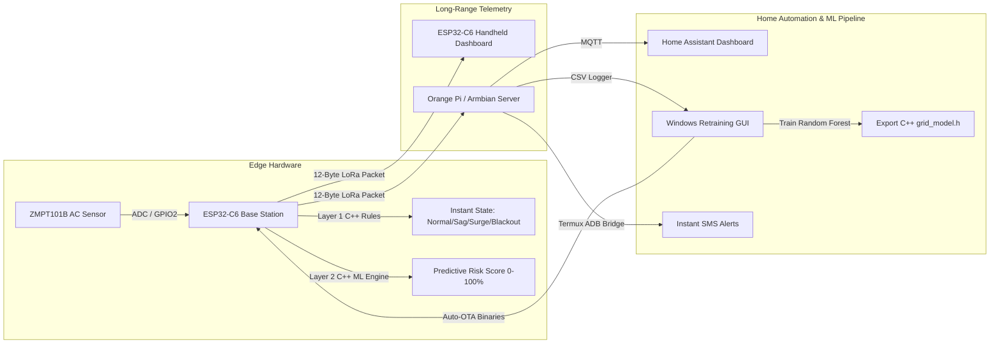

# GridWatcher


> **A $60 sensor + LoRa + a Raspberry Pi-class server that predicts power outages before they happen, texts you when your power drops, and retrains its own ML model automatically.**

---

## Why I Built This
Living with an unreliable local power grid meant sudden blackouts, lost work, and voltage sags damaging household electronics. Commercial utility monitors are either expensive proprietary hardware or reactive meters that only alert *after* the power is already out. GridWatcher was built to provide localized, real-time AC voltage and frequency telemetry with early-warning machine learning risk predictions and instant SMS notifications.

---

## System Architecture & Data Flow



---

## System Categorization

### Implemented in V1
* **True RMS AC Sampling**: ZMPT101B RMS voltage sampling and zero-crossing frequency detection on GPIO 2.
* **Layer 1 State Machine**: Real-time deterministic C++ grid state classification (`BLACKOUT`, `SURGE`, `BROWNOUT_SAG`, `FREQ_JITTER`, `NORMAL`).
* **12-Byte Binary LoRa Protocol**: Compact binary packet structure (`GridPacket`) with magic header verification (`0x4757`).
* **Handheld TFT Dashboard**: ESP32-C6 handheld receiver with ST7789 240x135 display rendering live electrical, battery, and signal status.
* **Android Termux Gateway & SMS Bridge**: Refurbished Android phone running Termux/ADB to log cellular tower telemetry, host live status web endpoints, and dispatch instant SMS outage alerts via `termux-sms-send`.
* **Home Assistant Integration**: Real-time MQTT telemetry reporting and Lovelace dashboard integration.
* **1-Click Windows Setup**: Standalone `install_startup.bat` script that configures `arduino-cli`, ESP32 cores, and required libraries.

### Experimental Features (V1)
* **Layer 2 ML Risk Engine**: Random Forest ensemble (`grid_model.h`) evaluating 8 model inputs to compute continuous 0–30s pre-outage risk scores.
* **Pure Timestamp Feature Extraction**: Pure timestamp-based search (`timestamp_ms`) computing 10s and 30s rolling rates of change and variance.
* **Dual-Stage Wireless Auto-OTA**: Wi-Fi self-flashing engine checking local server (`192.168.3.47:5000`) with direct GitHub HTTPS fallback.

### Planned for V2 (Future Revision)
* **Custom Integrated PCB**: Monolithic PCB design replacing devboards and point-to-point wiring.
* **Precision AC Front-End**: Dedicated high-voltage metering IC with factory calibration against laboratory reference meters.
* **Feature Importance & Model Interpretability**: Extract and log Gini feature importance (and SHAP values) from the trained Random Forest to confirm whether `cell_signal` contributes meaningfully or is redundant relative to AC-derived features.
* **Cryptographic Packet Security**: Hardware-accelerated AES-128 payload encryption and packet signing.
* **Dedicated Hardware Watchdog**: External timer IC for emergency hardware reset during power dips.

---

<details>
<summary><b>Click to expand Deep Technical Specifications & Architecture</b></summary>

### Repository Structure

```
GridWatcher/
├── home_sender/              # ESP32-C6 Base Station transmitter firmware
│   ├── home_sender.ino       # ZMPT101B RMS sampling, Layer 1 status, 12-byte LoRa TX
│   └── grid_model.h          # Exported C++ Random Forest decision tree model
├── gridwatcher_dashboard2/   # ESP32 Handheld receiver & TFT dashboard firmware
│   └── gridwatcher_dashboard2.ino
├── windows_trainer/          # Automated Windows training pipeline & GUI
│   ├── gridwatcher_ml_gui.py # PyQt GUI, gap-aware feature extractor, C++ exporter
│   └── install_startup.bat   # 1-click dependency installer (arduino-cli standalone)
├── WORKING_ON/               # Active development status & phase documentation
│   └── README.md
└── version.json              # Current firmware & ML model version manifest
```

### Core Technical Design

#### Design Philosophy
GridWatcher combines direct AC power delivery measurements with auxiliary environmental side-channel indicators to predict electrical grid instability.

#### 1. Dual-Layer Classification Architecture

* **Layer 1: Deterministic C++ State Machine (`home_sender.ino`)**
  Evaluates instantaneous voltage and frequency using strict severity precedence:
  1. **Blackout**: `V < 180.0V` or `F < 45.00Hz`
  2. **Voltage Surge**: `V > 250.0V`
  3. **Brownout Sag**: `180.0V <= V < 210.0V`
  4. **Frequency Jitter**: `210.0V <= V <= 250.0V` and (`F < 49.50Hz` or `F > 50.50Hz`)
  5. **Normal**: `210.0V <= V <= 250.0V` and `49.50Hz <= F <= 50.50Hz`

* **Layer 2: Experimental Time-Series ML Risk Model (`grid_model.h`)**
  Evaluates **8 total inputs** to compute continuous 0–30s pre-outage risk scores:

  ##### Feature Rationale & Engineering Hypotheses

  | Feature | Category | Rationale & Mechanics |
  |---|---|---|
  | `voltage` | Direct AC | Instantaneous RMS AC voltage (V); physically tracks supply level. |
  | `frequency` | Direct AC | Instantaneous line frequency (Hz); reflects utility generation/load balance. |
  | `dV_dt_10s` | Direct AC | 10-second voltage rate of change ($\text{V}/\text{s}$); detects rapid dips or surges. |
  | `dF_dt_10s` | Direct AC | 10-second frequency rate of change ($\text{Hz}/\text{s}$); catches sudden frequency decay. |
  | `v_std_30s` | Direct AC | 30-second voltage standard deviation; quantifies short-term AC amplitude instability. |
  | `f_std_30s` | Direct AC | 30-second frequency standard deviation; measures line frequency turbulence. |
  | `v_slope_30s` | Direct AC | 30-second linear regression voltage slope ($\text{V}/\text{s}$); captures multi-second voltage trend directional drift. |
  | `cell_signal` | Environmental | Cellular network tower signal strength (RSRP in dBm, clamped to -120 to 0 dBm). |

  * **Cellular RSRP Feature Rationale**:
    > **Engineering Hypothesis**: Cell towers sharing the regional utility feeder may show supply degradation or backup-power failover during severe grid stress, providing a secondary spatial/regional indicator alongside direct AC metrics. Expected to be a lagging signal (tower backup typically buffers 4–8 hours) rather than instantaneous, unlike the AC-derived features.

  Outputs an experimental risk score from 0.0% to 100.0% using an ensemble of 3 Random Forest decision trees (`max_depth=4`) exported directly into native C++ functions (`tree0()`, `tree1()`, `tree2()`).

#### 2. 12-Byte Binary LoRa Telemetry Protocol

Telemetry is packed into a 12-byte binary structure (`GridPacket`), providing an **approximately 2.8x reduction in payload data size** compared to the legacy 34-byte ASCII string payload ($34 / 12 \approx 2.83\times$):

```cpp
struct __attribute__((packed)) GridPacket {
    uint16_t magic = 0x4757;  // 2 Bytes: 'GW' Sync Header
    int16_t  voltage_x10;     // 2 Bytes: Scaled Voltage (e.g. 2301 = 230.1V)
    uint16_t freq_x100;       // 2 Bytes: Scaled Frequency (e.g. 5000 = 50.00Hz)
    uint8_t  status;          // 1 Byte: GridStatus Enum (0..4)
    uint8_t  risk_score;      // 1 Byte: Experimental Risk % (0..100)
    uint8_t  ml_version;      // 1 Byte: Model Version (ML_MODEL_VERSION)
    int8_t   rssi;            // 1 Byte: Cellular Tower Signal Strength RSRP (-120..0 dBm)
    uint8_t  base_battery;    // 1 Byte: Base Station Battery % (0..100)
    int8_t   phone_battery;   // 1 Byte: Phone Hotspot Battery % (-1 or 0..100)
};
// Total Size: 12 Bytes
```

Both Handheld and Server receivers validate `packet.magic == 0x4757` to verify packet structure and reject malformed or unrelated RF data.

### Machine Learning Pipeline & Training

1. Telemetry datasets are logged automatically by the Orange Pi server (~10s log interval).
2. `gridwatcher_ml_gui.py` loads `telemetry.csv` and computes rolling features with timestamp gap invalidation ($\Delta t > 35.0\text{s}$).
3. Samples are labeled with a continuous 0–30s forward-looking horizon (`target_risk = 1` if an anomaly occurs within the upcoming 30 seconds while current state is Normal).
4. Scikit-Learn performs a **chronological 80/20 train/test holdout split** on historical telemetry, fitting a 3-tree Random Forest classifier (**86.48% training accuracy / 82.75% test holdout accuracy** for live model **v31**) and exporting decision rules into `home_sender/grid_model.h`. *Note: Accuracy is an experimental metric evaluated on historical local dataset logs and does not serve as a guarantee of real-world outage prediction capability.*
5. The Base Station firmware is compiled using `arduino-cli` and updated wirelessly via local HTTP OTA or direct GitHub HTTPS fallback.

### Current Prototype Limitations

1. **Prototype Hardware Measurement**: The ZMPT101B analog sensing module and ESP32 ADC chain are prototype-grade components and have not been calibrated against laboratory-grade reference meters.
2. **Experimental ML Validation**: The machine learning model is trained on telemetry from a single installation site. Real-world outage prediction accuracy requires extensive multi-site dataset validation across diverse grid topologies.
3. **OTA Network Scope & Security**: While local network OTA endpoints (`/update`, `/trigger-ota`) operate unauthenticated within a trusted LAN boundary, the direct GitHub fallback path fetches firmware binaries over the public internet using `setInsecure()` TLS without certificate pin verification.
4. **Known Limitations of the Cellular RSRP Feature**:
   * **Single-Tower Dependency**: Telemetry currently observes a single cell tower's backup behavior rather than a true regional signal until multiple gateway locations are logging.
   * **Site & Carrier Variation**: Tower backup behavior varies significantly by carrier and site (battery-only vs. generator-backed), causing RSRP proxy reliability to be inconsistent across network sectors.
   * **Feature Importance Unvalidated**: RSRP has not yet been quantitatively validated against Gini/SHAP feature importance metrics to confirm whether the trained model actively relies on this feature during real anomaly events vs. riding along with AC voltage features.

</details>

---

## Local Setup & Installation

Sensitive credentials are excluded from source control via `.gitignore`:
* **Wi-Fi Credentials**: Loaded via `home_sender/secrets.h` (`#if __has_include("secrets.h")`) or hardware NVS storage.
* **AP & OTA Passwords**: Defined as configurable macros (`#ifndef AP_PASSWORD`, `#ifndef OTA_PASSWORD`) overridable via `secrets.h`.
* **Server Credentials**: `gridwatcher_ml_gui.py` checks environment variable `GRIDWATCHER_PI_PASS` or local `secrets.json` before falling back to dev defaults.

To set up a new machine:
1. Run `windows_trainer/install_startup.bat` to install `arduino-cli`, the ESP32 board core, required libraries (`RadioLib`, `Adafruit GFX`, `ST7789`, `BusIO`), and Python dependencies.
2. Launch `windows_trainer/gridwatcher_ml_gui.py` to run retraining and automated OTA deployment.
